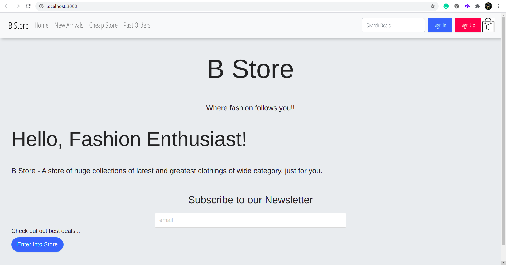
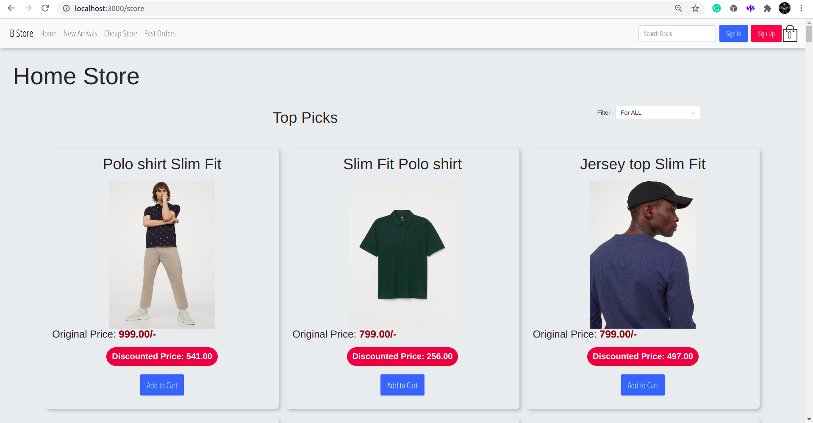
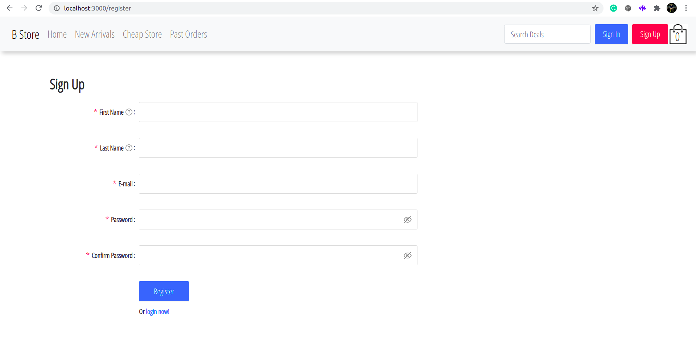
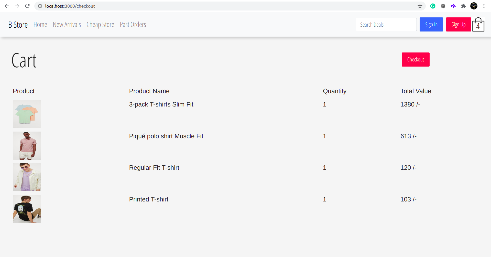
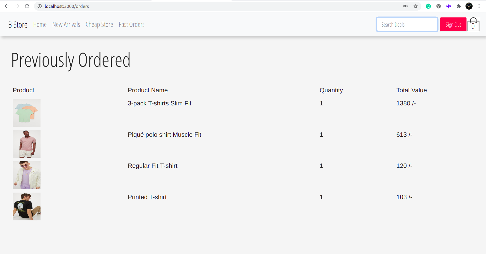

# Full Stack React Springboot Apparel Store

## How to run

- Clone the repository.
  
  ```shell
  $ git clone https://github.com/bisakhmondal/FullStack-Apparel-Store-Springboot-React.git
  ```

- Setup a postgres instance and update the configuration file [**here**](apis/src/main/resources/application.properties).
  
    > If you are unsure about the postgres setup, you can always use docker. It's extremely simple. Run the command below :

    ```shell
    $ docker run  --name psql -d -p 5432:5432 -e POSTGRES_USER=<give a username> -e "POSTGRES_HOST_AUTH_METHOD=trust" postgres
    # This will create a postgres container named `psql`
    ```

- [Optional]: If you want to insert dummy data into the postgres db run the below command from your terminal:

    ```shell
    $ psql -h 127.0.0.1 -d bstore -p 5432 -U <same postgres username> -c "copy product FROM 'dummy_data.csv' DELIMITER '$' CSV HEADER";

    ```

- Run the Backend:
  
  ```shell
  # This will also bootstrap the required relations schema into the current database.
  ./mvnw spring-boot:run
  ```

- Run the frontend:

  ```shell
  npm i && npm start
  ```
  
  [ If you are using the application in localhost, please visit [chrome://flags/#allow-insecure-localhost](chrome://flags/#allow-insecure-localhost) and enable the option that says "Allow invalid certificates for resources loaded from localhost" due to the certificate [file](apis/src/main/resources/https.p12) being a self signed certificate and the backend being `HTTPS Ready`. ]

## Screenshots

Frontend                  |  Screenshots
:-------------------------:|:-------------------------:
  |  
  |  
  |  

## License

```
Licensed under the Apache License, Version 2.0 (the "License");
you may not use this file except in compliance with the License.
You may obtain a copy of the License at

   http://www.apache.org/licenses/LICENSE-2.0

Unless required by applicable law or agreed to in writing, software
distributed under the License is distributed on an "AS IS" BASIS,
WITHOUT WARRANTIES OR CONDITIONS OF ANY KIND, either express or implied.
See the License for the specific language governing permissions and
limitations under the License.
```

Thanks,

Bisakh.
